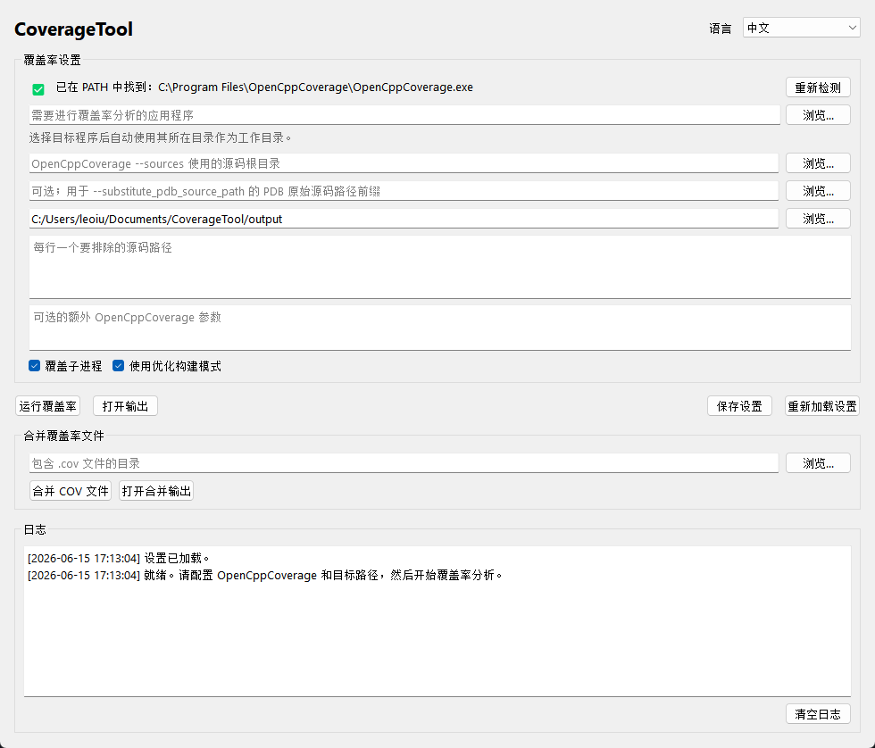

# CoverageTool

CoverageTool 是一个 Windows 桌面端 [OpenCppCoverage](https://github.com/OpenCppCoverage/OpenCppCoverage) 图形界面工具。它会从 `PATH` 自动检测 `OpenCppCoverage.exe`，并提供目标程序、源码目录、可选 PDB 源码路径替换、输出格式、排除路径和 COV 文件合并等常用配置。

## 解决的核心痛点

OpenCppCoverage 原项目主要通过命令行使用，参数较多且不容易记忆。CoverageTool 将常用覆盖率分析流程封装成 GUI 快捷操作，让用户通过选择目标程序、源码目录、输出目录和排除规则即可生成覆盖率报告，减少反复查命令和手写参数的成本。

## 功能

- 从 `PATH` 自动检测 `OpenCppCoverage.exe`，未检测到时提供 GitHub 下载入口。
- 配置目标程序、源码目录、可选 PDB 源码路径替换、输出目录、排除源码路径和额外 OpenCppCoverage 参数。
- 根据目标程序所在目录自动推断工作目录。
- 执行覆盖率分析并生成 HTML、二进制 COV 和 Cobertura XML 结果。
- 合并已有 `.cov` 文件，输出 HTML、二进制 COV 和 Cobertura XML 报告。
- 支持运行时切换英文和简体中文界面。
- 使用 `QSettings` 保存本地配置。

## 程序截图



## 环境要求

- Windows
- Visual Studio 2022，包含 v143 工具集
- CMake 3.16 或更高版本
- Qt 5.12.12 x64，且包含 CMake package files，例如 `D:\Qt\Qt5.12.12\5.12.12\msvc2017_64`
- 单独安装 OpenCppCoverage，并将其加入 `PATH`

本仓库不内置 OpenCppCoverage、Qt 或其他第三方工具二进制文件。

## 构建

```powershell
.\build.ps1 -Configuration Debug -Platform x64
.\build.ps1 -Configuration Release -Platform x64
```

如果 Qt 未安装在常见路径，可以显式传入 Qt 路径：

```powershell
.\build.ps1 -Configuration Release -Platform x64 -QtDir D:\Qt\Qt5.12.12\5.12.12\msvc2017_64
```

本仓库使用 CMake 作为构建系统。生成的 Visual Studio 工程文件会写入 `build/`，不会提交到仓库。

本仓库不随源码分发 OpenCppCoverage、Qt 或其他第三方二进制文件。

## 使用

1. 启动 `CoverageTool.exe`。
2. 确认 OpenCppCoverage 已被检测到。如果未检测到，点击下载按钮安装，并将其加入 `PATH`。
3. 选择目标程序和源码目录。工作目录会自动使用目标程序所在目录。
4. 按需设置 PDB 源码路径、排除源码路径和额外 OpenCppCoverage 参数。
5. 选择输出目录。
6. 点击 `运行覆盖率`。

如果需要合并覆盖率文件，选择包含 `.cov` 文件的目录，然后点击 `合并 COV 文件`。
